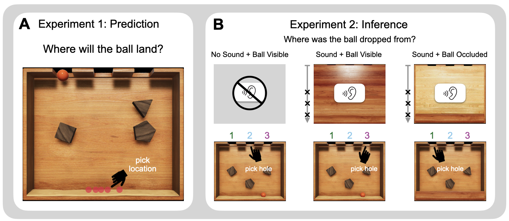

# Multimodal inference through mental simulation

**Contents**:
- [Introduction](#introduction)
- [Repository structure](#repository-structure)
- [CRediT author statement](#credit-author-statement)

## Introduction

<div align="center"></div>

When navigating the world, people must constantly coordinate multiple kinds of sensory information. For example, sights and sounds together can be used to refine inferences that would be incomplete on the basis of one kind of sense data. Prior research has shown that people are quite adept at combining sensory cues in perceptual tasks. But these experiments often involve fairly simple causal structure. Higher level inferences from sensory information are made against the backdrop of a complex physical world. In order to perform these more challenging inferences, people must coordinate sensory information in an intuitive theory that reflects the complex causal structure of their environement. In this work, we explore how people perform these higher-level multimodal inferences by coordinating sensory information in an underlying causal model of their environment.

To examine this ability we develop the Plinko Task. Plinko is an intuitive physics setting for studying human predictions, inferences, and multimodal integration. The figure above illustrates the the domain. In the prediction task, participants see the the Plinko box and a ball drop location, and they must indicate by clicking where they think the ball will fall. In the Inference task, participants are divided in different sensory conditions and receive different combinations of sensory cues to determine where the ball fell from. In the "No Sound + Ball Visible" condition, participants see the final location of the ball after a drop and must infer which hole the ball fell from. In the "Sound + Ball Visible" condition, participants first hear the sound of the ball dropping as it collides with various obstacles and then lands in the sand. They then view the uncovered Plinko box with the ball at its final location, and they can now combine this auditory and visual information to make their inference. In the "Sound + Ball Occluded" condition, participants again first hear the the sound of the ball dropping, and then view a partially uncovered Plinko box where the obstacles are visible, but the ball location is occluded. Here again, participants can make the inference with the combination of auditory and visual cues.

We model participant behavior in these two tasks using an Intuitive Physics Engine (IPE). The IPE is a model of people's intuitive theory of physics that represents how people use mental simulation to make predictions and inferences in Plinko. The IPE emulates the structured uncertainty apparent in people's physical judgments by running repeated noisy simulations in a computational physics engine. In the prediction task, we show that the IPE does an excellent job matching the distribution of predictions that participants provide in our experiment. We follow this up in the inference task by demonstrating how the IPE can coordinate different sensory cues from vision and sound to create a unified inference model that captures participant judgments across conditions. Furthermore, we demonstrate that the simulations from the IPE in a Sequential Sampling model correspond to the distribution of participant eye-movement in the inference task, emphasizing how people selectively focus their simulations to plausible hypotheses when performing these inferences.

## Repository structure 

```
.
├── README.md
├── code
│   ├── R
│   ├── experiments
│   └── python
├── data
│   ├── data-readme.md
│   ├── human_data
│   └── stimuli
└── figures
    ├── paper_figures
    └── stimuli
```

### code 

Put all your code here. Use a separate folder for scripts based on the programming language. 

#### experiments 

Contains code for the prediction and inference experiments. The prediction task is run using [psiturk](https://psiturk.org/). The inference task is run using [psychopy](https://www.psychopy.org/).

See `experiments-readme.md` for details of how to run experiments.

#### python

Contains model code for both experiments. See `python-readme.md` for details of how to reproduce model behavior.

#### R

Contains code for visualizing primary paper results. Run all code blocks `figure_plotting.Rmd` to generate results figures used in the paper. In order to run, model behavior must be previously generated. Rendered analysis can be viewed [here](https://cicl-stanford.github.io/multimodal_plinko/index.html).

### data 

Contains raw and processed data for both experiments.

### figures 

Final form paper figures as well as stimuli images for both experiments.

## CRediT author statement 

For details about the different terms see [here](https://www.elsevier.com/authors/policies-and-guidelines/credit-author-statement). 

| Term                       | Ari | Yingchen | Max | Satchel | Alan | Philipp | Josh | Scott | Tobi |
|----------------------------|-----|----------|-----|---------|------|---------|------|-------|------|
| Conceptualization          | x   | x        | x   |         |      |         | x    |       | x    |
| Methodology                | x   | x        | x   |         |      |         | x    | x     | x    |
| Software                   | x   | x        | x   | x       | x    | x       |      |       | x    |
| Validation                 | x   |          |     | x       |      |         |      |       | x    |
| Formal analysis            | x   |          | x   | x       |      | x       |      | x     | x    |
| Investigation              | x   |          |     |         | x    |         |      |       | x    |
| Resources                  |     |          |     |         | x    |         |      |       |      |
| Data Curation              | x   |          |     |         | x    |         |      |       |      |
| Writing - Original Draft   | x   |          |     | x       |      |         |      |       |      |
| Writing - Review & Editing | x   | x        | x   | x       |      | x       | x    | x     | x    |
| Visualization              | x   |          |     |         |      | x       |      |       | x    |
| Supervision                |     |          |     |         |      |         | x    |       | x    |
| Project administration     | x   |          |     |         |      |         |      |       | x    |
| Funding acquisition        |     |          |     |         |      |         | x    |       | x    |


